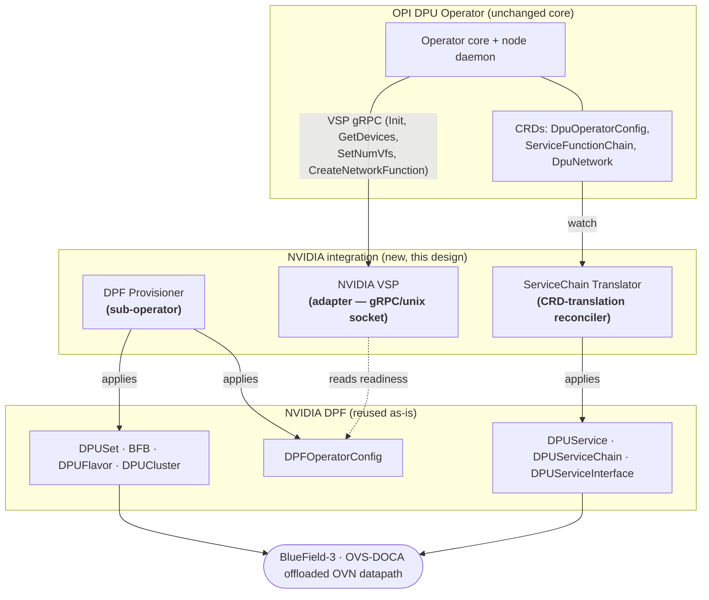
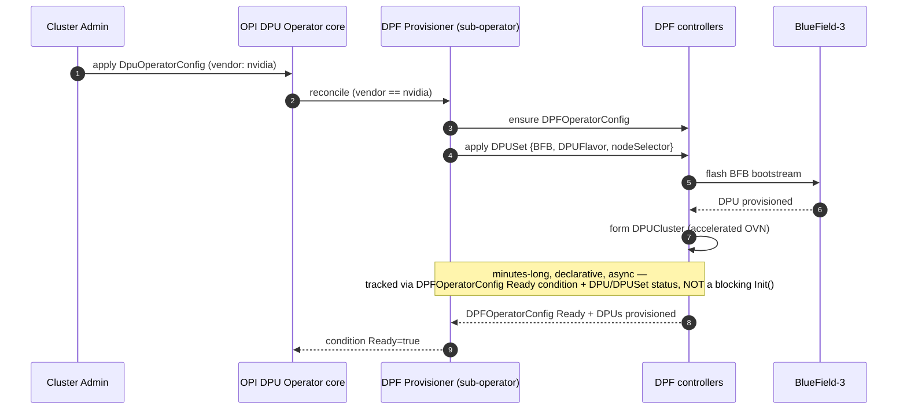
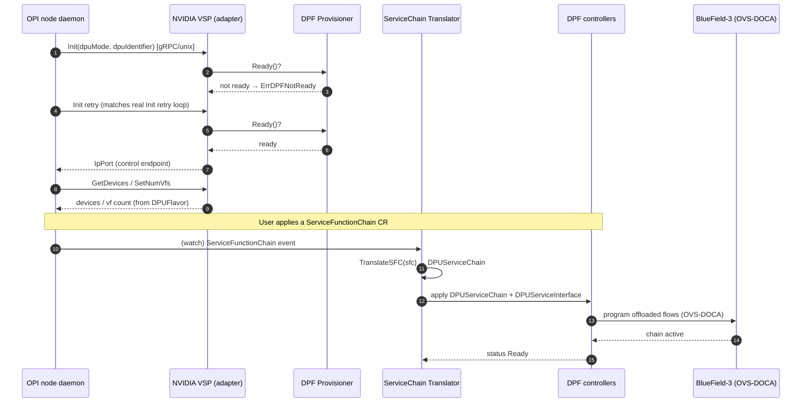

# Architecture Design — NVIDIA BlueField (DPF) Support in the OPI DPU Operator

**Assignment 1 — LLM-Assisted Architecture Design for OPI DPU Operator**
**Author:** Vicky Sharma · github.com/vickysharma-prog
**Date:** 2026-07-02
**LLM used:** a general-purpose LLM assistant. Full prompt/response session in `llm_transcript.json`.

> **How to read this doc:** §1–§2 establish the *real* current state of both operators (verified
> against source, not assumed). §3 states the core architectural finding. §4 is the proposed
> design with sequence diagrams. §5 is the trade-off analysis (the heart of the assignment).
> §6 covers mapping fidelity, §7 rejected alternatives, §8 risks. Assumptions: `ASSUMPTIONS.md`.

---

## 1. Problem statement

The OPI DPU Operator (`github.com/openshift/dpu-operator`, mirrored at
`github.com/opiproject/dpu-operator`) provides a **vendor-neutral** way to manage DPUs/IPUs in
Kubernetes/OpenShift. Today it ships **Vendor Specific Plugins (VSPs)** for **Intel IPU** and
**Marvell Octeon**. NVIDIA ships its own, standalone, mature operator — **DPF (DOCA Platform
Framework**, `github.com/nvidia/doca-platform`) — which provisions BlueField-3 and runs an
accelerated OVN-Kubernetes datapath offloaded to the DPU.

**Goal:** design an architecture that brings NVIDIA BlueField support into the unified OPI
operator ecosystem **while maximizing reuse of the existing DPF operator** — i.e. NVIDIA should
become a first-class DPU-Operator vendor *without* re-implementing provisioning or offload that
DPF already does well.

---

## 2. Current state (verified against source, 2026-07-02)

### 2.1 How the OPI DPU Operator integrates a vendor today

The operator core does **not** talk to hardware directly. It talks to a per-node **VSP** over
**gRPC on a unix socket**. The Go-side contract is
`internal/daemon/plugin.VendorPlugin`:

```go
type VendorPlugin interface {
    Start(ctx context.Context) (string, int32, error)   // -> LifeCycleService.Init
    Close()
    CreateBridgePort(*opi.CreateBridgePortRequest) (*opi.BridgePort, error) // OPI EVPN-GW API
    DeleteBridgePort(*opi.DeleteBridgePortRequest) error
    CreateNetworkFunction(input, output, bridgeID string) error   // NetworkFunctionService
    DeleteNetworkFunction(input, output, bridgeID string) error
    GetDevices() (*pb.DeviceListResponse, error)         // DeviceService
    SetNumVfs(vfCount int32) (*pb.VfCount, error)
    SetDpuNetworkConfig(isAccelerated bool) error        // DpuNetworkConfigService
}
```

The wire contract (`dpu-api/api.proto`, package `Vendor`) exposes:
`LifeCycleService.Init(dpu_mode, dpu_identifier) → IpPort`, `DeviceService` (GetDevices /
SetNumVfs), `NetworkFunctionService` (Create/DeleteNetworkFunction), `DpuNetworkConfigService`
(SetDpuNetworkConfig), `HeartbeatService.Ping`, and — notably — the **OPI EVPN-GW
`BridgePortService`** (`github.com/opiproject/opi-api`). So the seam is itself partly built on
OPI's own vendor-neutral API.

**User-facing CRDs** (`api/v1`): `DpuOperatorConfig` (cluster-scoped, minimal spec),
`DataProcessingUnit`, `DpuNetwork`, and `ServiceFunctionChain` (an ordered list of
`{name, image}` network functions with a `NodeSelector`).

**Characterization:** the model is **per-node, imperative, SR-IOV-VF + network-function/SFC
oriented**. It is *not* a full primary-datapath OVN offload model.

### 2.2 What DPF exposes

DPF is a full operator with rich, **cluster-scoped, declarative** CRDs:

| Group | Key CRDs | Role |
|---|---|---|
| `operator.dpu.nvidia.com` | `DPFOperatorConfig` | Top-level: installs/configures DPF itself |
| `provisioning.dpu.nvidia.com` | `BFB`, `DPUFlavor`, `DPUSet`, `DPU`, `DPUCluster` | Flash BlueField bootstream, define VF/SF flavor, provision DPUs, form the DPU cluster |
| `svc.dpu.nvidia.com` | `DPUService`, `DPUServiceChain`, `DPUServiceInterface`, `DPUServiceIPAM`, `DPUServiceNAD`, `DPUDeployment` | Deploy services onto DPUs; wire the accelerated-OVN datapath and service chains |

**Characterization:** DPF is **cluster-scoped, declarative, and asynchronous** — provisioning a
BF3 (BFB flash + `DPUCluster` formation) is a **minutes-long** reconcile, not a synchronous call.

---

## 3. Core architectural finding (the crux)

> **A pure VSP adapter is necessary but NOT sufficient to "maximize DPF reuse."**

The decisive axis is **scope**: the VSP seam is **per-node** — the operator dials one plugin per
node over a unix socket to manage that node's local hardware (`GetDevices`, `SetNumVfs`,
`CreateNetworkFunction`). DPF's most valuable capability — provisioning BlueField-3 (flash BFB,
form a `DPUCluster`) and standing up the offloaded OVN datapath — is inherently **cluster-scoped
and declarative**: it is driven by cluster CRDs and reconciled asynchronously over minutes.

A per-node imperative plugin is the wrong *shape* to own a cluster-scoped, long-running,
declarative lifecycle. (The operator's real `Start()` even has an init retry loop, so slow init
alone isn't the blocker — the mismatch is scope and lifecycle, not just latency.) If we force all
of DPF through the per-node VSP straw, we bottleneck exactly the capability we came to reuse.
Therefore the integration must **split responsibilities by concern**, and be explicit about the
boundary. That split is the design.

---

## 4. Proposed architecture

Three collaborating components, each mapped to the **one** integration pattern it actually fits:

| Component | Pattern | Concern it owns |
|---|---|---|
| **DPF Provisioner** | **Sub-operator** | Install DPF; own `DPFOperatorConfig` + `DPUSet`/`BFB`/`DPUFlavor` lifecycle (cluster-scoped, async). |
| **NVIDIA VSP** | **Adapter** | Implement the node-local VSP gRPC contract (device enum, VF count, NF wiring) so NVIDIA is a first-class vendor. Does **no** provisioning; verifies DPF readiness. |
| **ServiceChain Translator** | **CRD-translation** | Reconcile DPU-Operator intent CRDs (`ServiceFunctionChain`, `DpuNetwork`) → DPF CRDs (`DPUServiceChain`, `DPUServiceInterface`). |

A compilable skeleton of all three is in `feature_skeleton.go`.

### 4.1 Component / boundary view



### 4.2 Sequence — Day-0 provisioning (asynchronous; owned by the sub-operator)

This is the flow the VSP **cannot** carry synchronously, which is why it is a separate component.



### 4.3 Sequence — Runtime datapath wiring (VSP adapter + CRD translation)

Once DPF is ready, the DPU Operator drives NVIDIA exactly like any other vendor.



---

## 5. Trade-off analysis

Each candidate pattern, stated by **what it can and cannot carry** — the reason the final design
assigns each pattern to a single concern instead of picking one globally.

| Pattern | What it carries well | What it **cannot** carry | Verdict |
|---|---|---|---|
| **Pure Adapter** (NVIDIA VSP only) | Node-local device enum, VF count, per-NF wiring; makes NVIDIA a first-class vendor with **zero core changes**. | Cannot express DPF's cluster-scoped, **async minutes-long** provisioning through synchronous `Init()`; bottlenecks full OVN offload. | **Use — but only for the node-local surface.** |
| **Sub-operator** (OPI installs & owns DPF) | Cluster-scoped, async **provisioning lifecycle** (DPFOperatorConfig/DPUSet/BFB); maximal DPF reuse. | Overkill and wrong shape for the fast, per-node imperative calls; duplicates VF plumbing if used for everything. | **Use — but only for the DPF lifecycle.** |
| **Pure CRD-translation** (standalone controller, no VSP) | Clean declarative mapping of intent CRDs → DPF CRDs. | Bypasses the operator's existing VSP/device plumbing → NVIDIA is **not** a real vendor; parallel, inconsistent path. | **Use — but only for intent→DPF CRD mapping.** |
| **Hybrid (this design)** | Each concern handled by its best-fit pattern; DPF reused wholesale; core essentially unchanged. | More moving parts; must define the boundary crisply (done in §3–§4). | **Selected.** |

**Why "maximize reuse of DPF" points to the hybrid:** the sub-operator delegates *all* of
provisioning and datapath offload to DPF (no re-implementation); the translator only re-expresses
intent; the adapter is a thin shim. NVIDIA-specific logic is minimized; DPF does the heavy lifting.

---

## 6. Mapping fidelity (where the translation is lossy)

Being explicit about lossy edges is part of the design (and is enforced in `feature_skeleton.go`
comments so implementers see it).

| OPI DPU-Operator surface | DPF target | Fidelity |
|---|---|---|
| `DpuOperatorConfig` (vendor=nvidia) | `DPFOperatorConfig` + `DPUSet` | **1:N** — one intent expands into DPF install + provisioning set. |
| `ServiceFunctionChain` (flat `{name,image}` list) | `DPUServiceChain` (ServiceChainSet template of ports/interfaces) | **Forward-lossy** — a linear chain synthesizes cleanly, but SFC cannot express DPF's branch/multi-port topologies; **reverse-lossy** — non-linear DPF chains don't round-trip to SFC. |
| `SFC.NodeSelector` (host node labels) | `DPUServiceChain.DPUClusterSelector` / ServiceChainSet `NodeSelector` | **Semantic shift** — selection domain is *host nodes* vs *DPU nodes*; needs a documented mapping convention. |
| `SetNumVfs(n)` (imperative) | `DPUFlavor` VF config (declarative) | **Model shift** — imperative call becomes a declarative patch; effective on next DPF reconcile, not instantly. |
| `CreateNetworkFunction(in,out,bridge)` / `CreateBridgePort` (OPI EVPN-GW) | `DPUServiceInterface` / `DPUServiceNAD` | Structural but mostly 1:1 per interface. |

---

## 7. Alternatives considered and rejected

- **Fork DPF into the DPU Operator / reimplement OVS-DOCA offload natively.** Rejected: violates
  the explicit "maximize reuse of DPF" goal; enormous maintenance burden; duplicates a mature stack.
- **Single monolithic controller doing provisioning + translation + serving gRPC.** Rejected: the
  synchronous VSP `Init()` and the async provisioning have incompatible lifecycles (§3); merging
  them forces one to block the other.
- **Only a CRD-translation layer, skip the VSP.** Rejected: NVIDIA would not appear as a real
  DPU-Operator vendor (no device/VF integration), breaking the "unified operator ecosystem" goal.

---

## 8. Risks & open questions

1. **DPUFlavor ↔ SetNumVfs semantics** — imperative→declarative timing; needs a readiness gate so
   the daemon doesn't assume VFs exist before DPF reconciles.
2. **SFC topology expressiveness** — if SFC must express DPF's richer chains, propose upstreaming a
   richer SFC schema rather than overloading the lossy mapping.
3. **Two reconcile domains** (host cluster vs DPU cluster) — the translator must target the correct
   `DPUCluster`; selector conventions must be defined.
4. **Ownership/finalizers** — sub-operator must not delete a user-managed DPF install; use
   `helm.sh/resource-policy=keep`-style guards (DPF already annotates some CRDs this way).

---

## 9. Assumptions

Summarized here; full list in `ASSUMPTIONS.md` (per the assignment's "make a reasonable assumption
and document it" rule):

- **NVIDIA over AMD** as the target vendor (DPF is the named reuse target and is mature).
- **`openshift/dpu-operator` = canonical upstream**; `opiproject/dpu-operator` is the OPI-org copy
  (both verified non-forks with near-identical trees, 2026-07-02).
- The design targets the **OpenShift Virtualization / KubeVirt-on-offloaded-fabric** end state DPF
  enables; KVM-only offload is a subset.
